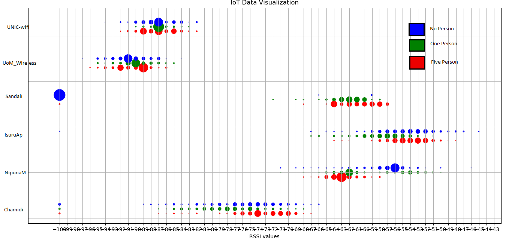
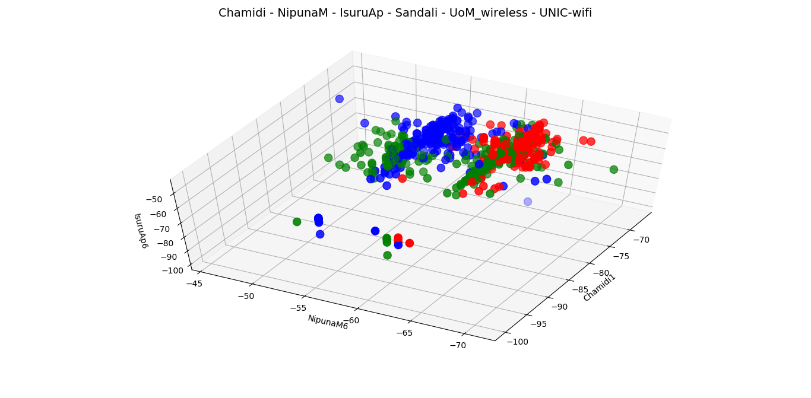
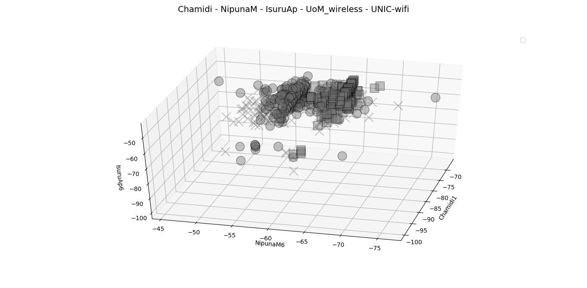

# Person-Detection Using Wifi

## This project is to develop person detection inside a room with existing wifi routers.

This simple application includes following components.

* ESP8266 - Scan for SSID and RSSI [Data Collection]

* MQTT central server [iot.eclipse.org] or Docker Mosquito MQTT server

* Python MQTT client - Subscribe to the relevant topic for data 

* Model Training [SVM or Appropriate ML model]

* Arduino Uno - Display Person Availability

## Graphical Clarification

Understanding the nature of the data set is very important in building a better prediction model. Therefore, in this section we are going to provide some visual representations to support our results.

### 1. Data distribution

All data points of each wireless access point are plotted in the same scale. The radius of the each point is proportional to the frequency of the respective RSSI value.

<<<<<<< HEAD
   
=======
   
>>>>>>> 3a864cb042781845d41309d49d6df0787dedb729

 

Observations :
* Some RSSI values have higher frequencies (points with higher radius).

* Points with higher frequencies of each AP are not in the same pattern. 

### 2. 3D plot (considering 3 APs)

Following 3D plot developed based on data sets of  three wireless access points ; Chamidi, NipunaM, IsuruAp. 

<<<<<<< HEAD
   
=======
   
>>>>>>> 3a864cb042781845d41309d49d6df0787dedb729

 

Observations:

* 3 clusters for no-person, two-person,five-person events 

## 3. 5D plot (considering 5 APs)

<<<<<<< HEAD
   
=======
   
>>>>>>> 3a864cb042781845d41309d49d6df0787dedb729

 

